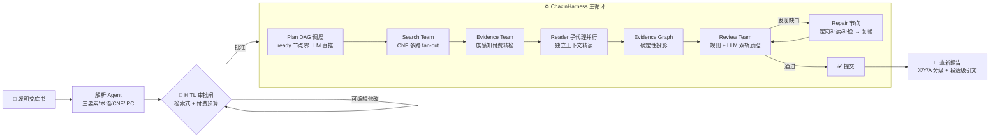
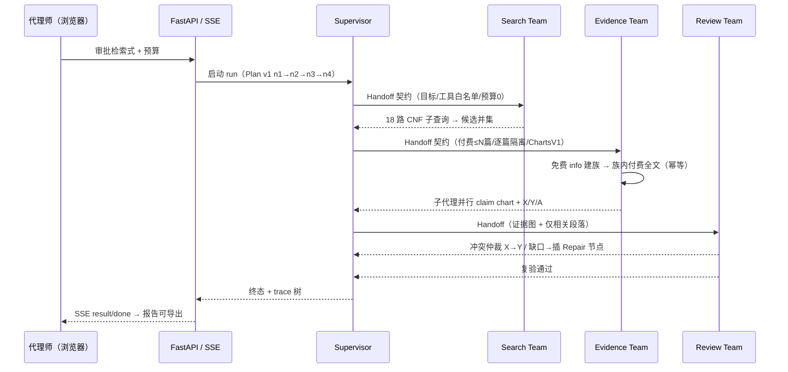
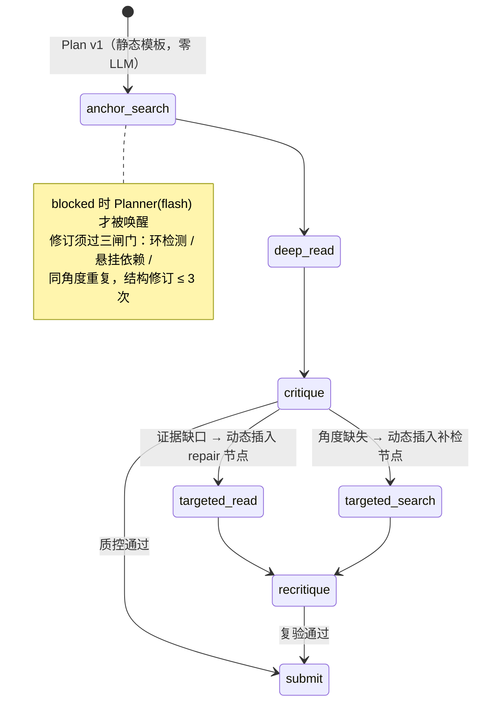
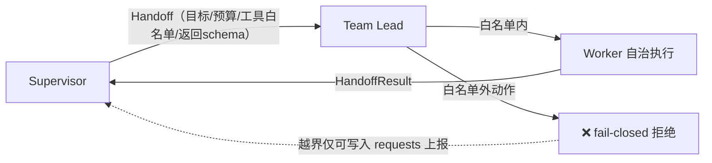
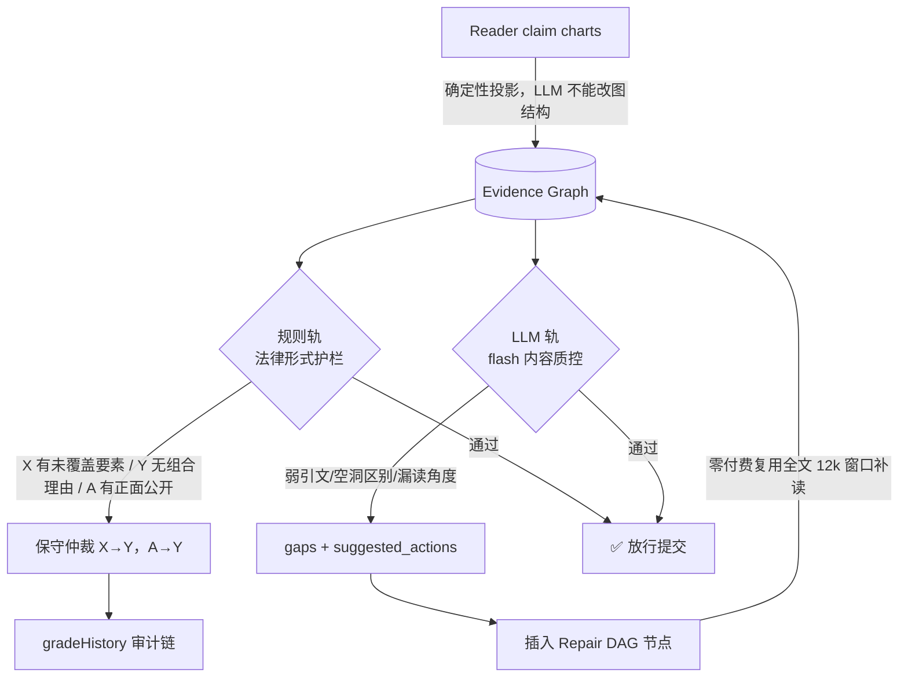
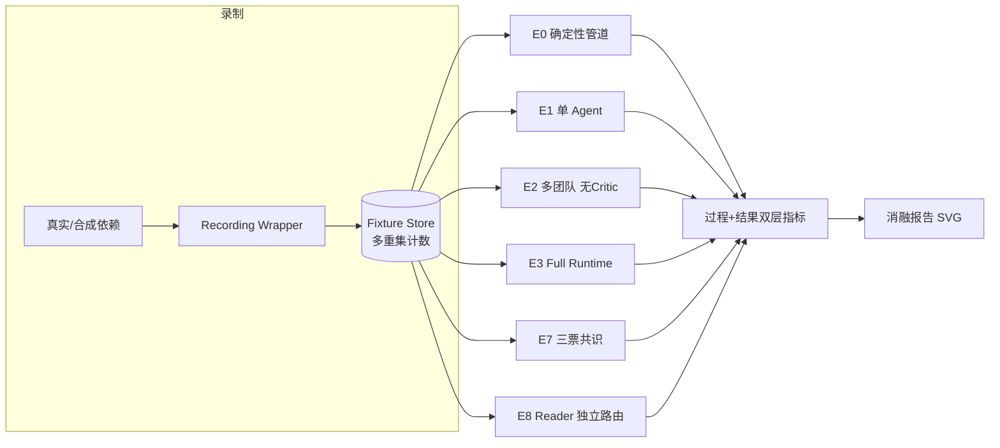
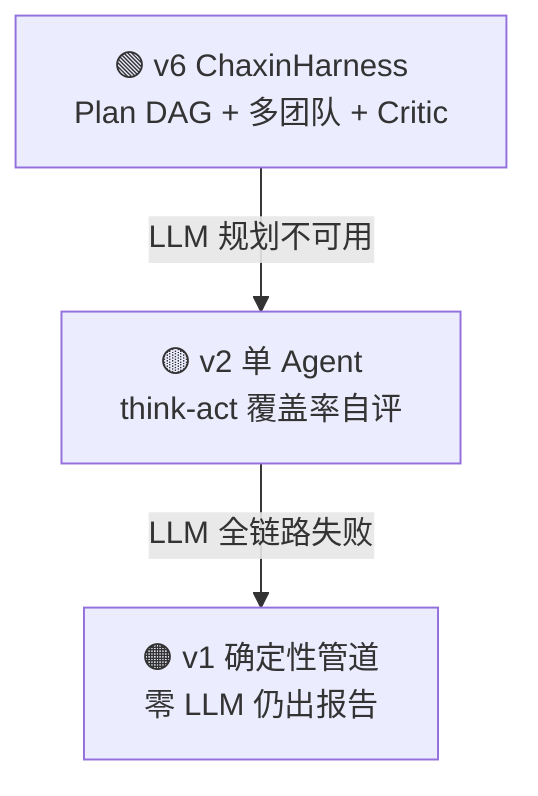

<div align="center">

# Patent-Agent · ChaxinHarness

### 一个从零自研的专利查新多智能体系统 · 含完整 Agent Runtime、证据质控闭环与轨迹级消融评测

[](https://www.python.org/)
[](https://fastapi.tiangolo.com/)
[](#-agent-runtime-七大机制)
[](#-为什么不用-langchainlanggraph)
[](#%EF%B8%8F-%E5%8F%AF%E9%9D%A0%E6%80%A7%E4%B8%89%E7%BA%A7%E9%99%8D%E7%BA%A7--%E6%95%85%E9%9A%9C%E6%B3%A8%E5%85%A5)
[](LICENSE)

</div>

---

Patent-Agent 是一个面向专利新颖性/创造性检索（查新）场景的 **Agentic 系统**：代理师上传发明交底书，系统自动解析技术要素、生成可审批的检索式，调度多智能体团队完成两阶段检索、隔离精读与法律相关性分级，最终产出**每一条结论都可溯源到章节段落**的查新报告。

与"用 LangChain 拼一条 chain"不同，本项目的核心是 **ChaxinHarness —— 一个不依赖任何 Agent 框架、核心全部用 Python 标准库实现的智能体运行时**：运行时可改写的动态计划图、强类型团队交接、证据图驱动的反思修复、故障自愈、事件溯源追踪，以及一套可零成本复现的消融评测体系。

| | |
|---|---|
| 🧠 **7 大 Runtime 机制** | Dynamic Plan DAG · Typed Handoff · Capability Router · Evidence Graph Critic-Repair · Recovery Engine · Experience Memory · Trajectory Eval |
| 👥 **3 类专职智能体团队** | Search Team（检索）· Evidence Team（付费精检+并行精读）· Review Team（证据质控） |
| 🛡️ **零信任证据链** | LLM 结论经确定性法律护栏裁决，引文逐条做专利原文定位校验，防幻觉三道关 |
| 🔁 **确定性可复现** | 外部依赖全量录制回放、6 变体消融、两次 replay 指标逐字节一致 |
| 💸 **真实付费场景** | 同族去重 + 两道幂等，断点重跑绝不重复扣费，预算由人工审批锁定 |

---

## 🧭 一次查新任务的完整生命周期



**端到端事件时序**（全部经 SSE 实时推送，同时落 append-only 事件日志）：



---

## 🧠 Agent Runtime 七大机制

ChaxinHarness 的设计主张：**把判断留给模型，把边界焊死在代码里。**
一次 run 中 LLM 只做四件事——交底书解析、计划修订（仅阻塞时）、专利精读、质控批判；检索式编译、候选合并、预算控制、工具路由、计划状态机、法律护栏、状态折叠全部是确定性代码。

### M1 · Dynamic Plan DAG —— 会自己改计划的智能体



- **常规推进零 LLM**：ready 节点由确定性状态机直接执行；只有图走不动（空结果/失败/缺口）时才调用 Planner——真实案件实测规划 LLM 可做到一次不调用即收敛
- **修订三闸门**：LLM 输出的 `insert/retry/skip/update_args` 绝不裸 apply——依赖环检测、悬挂引用校验、同词重复拦截逐层过滤，非法修订以「规则号 + 被拒内容 + 可行替代」三要素回喂
- **全程可追溯**：每个节点带 `origin`（initial / inserted_by_planner / inserted_by_critic）与因果链，轨迹归因到具体决策者

### M2 · Typed Handoff —— 带契约的多智能体协作

团队之间不传消息串，而是交换**强类型任务契约**：目标、成功标准、工具白名单、预算上限、返回 schema、截止时间。



Worker **不能自行换工具、加预算、改检索式**——局部自救允许（重试），策略性变更必须上报 Supervisor 决策，保证全局计划图与付费账本不被旁路。

### M3 · Capability-aware Tool Router —— 声明式工具协议

- `intent → capability 过滤 → 熔断过滤 → 成本排序 → 执行`，60 秒滑动窗口失败 5 次自动熔断，鉴权/余额类失败立即终止不做无意义重试
- **ToolSchema / ToolCall / ToolResult 三对象协议**统一进程内函数与远程 MCP 工具：Router 只认协议，不感知工具来自哪里
- 规则全可解释、每次决策进 trace；样本量不支持统计学习就**明确不做伪学习**

### M4 · Evidence Graph + Critic-Repair —— 本系统最核心的质量闭环

LLM Reader 产出的 claim chart 先被**确定性投影**为证据图（Claim → Feature → Evidence → Patent/Grade），再进入双轨质控：



- **规则与 LLM 冲突时规则胜诉**：法律形式正确性是硬约束，内容充分性才交给模型
- 质控 LLM 无权直接改分级，只产证据缺口与建议；最终裁决由确定性仲裁执行并留痕
- 修复最多 2 轮，修不完走 **G8 保守收尾**（结论降级措辞 + 标注人工复核），绝不死循环

### M5 · Recovery Engine —— 8+1 类故障的自愈矩阵

| 故障类 | 恢复策略 | 行为 |
|---|---|---|
| TOOL_TRANSIENT | 退避重试 | 节点级自动恢复 ≤2 次，**不打扰 Planner** |
| TOOL_AUTH | 立即中止 | 重试无意义，错误直达用户 |
| TOOL_BUDGET | 免费降级 | 余额耗尽照样交付免费粗检结果 |
| ZERO_RESULT | 换角度规划 | 禁止同词重发，换同义词/IPC 或判为区别特征 skip |
| PLAN_INVALID | 三要素回喂 | 结构化错误指导 Planner 自纠 |
| LLM_DEGRADED | 确定性降级 | 逐级下沉，服务不中断 |

关键设计：**Recovery 与 Planner 职责分离**——执行问题自动重试，策略问题才升级规划。6 条恢复路径由故障注入套件持续回归（见下）。

### M6 · Experience Memory —— 克制的建议态记忆

从代理师的人工勘误（检索式增删词、X/Y/A 改判）中离线抽取结构化经验：只存 IPC 与检索词等**抽象信号，绝不存交底书原文**；样本 <10 条整体禁用；Planner 阻塞时最多注入 3 条**带来源、可忽略**的建议，任何情况下不自动改变系统行为，采纳结果再做保守的置信度反馈。

### M7 · Trajectory Evaluation —— 像研究系统一样评测 Agent

外部 API 与 LLM 响应在**同一接口边界**全量录制，六个架构变体在相同 fixture、温度 0 下确定性回放：



**管线验证消融结果**（确定性 replay，两次运行逐字节一致）：

| 指标 | E0 基线 | E1 单 Agent | E2 多团队 | **E3 Full** | E7 三票 | E8 独立Reader |
|---|---|---|---|---|---|---|
| recall@20 | 1.00 | 1.00 | 1.00 | **1.00** | 1.00 | 1.00 |
| 分级准确率 grade_acc | — | 0.83 | 0.83 | **1.00** | 1.00 | 1.00 |
| 证据精度 evidence_precision | 1.00 | 1.00 | 1.00 | **1.00** | 1.00 | 1.00 |
| 计划效率 plan_efficiency | — | — | 1.00 | **0.88** | 0.88 | 0.88 |
| LLM 调用（均值） | 0 | 3 | 3 | **4** | 6 | 4 |

> 实验中有一个刻意的"反直觉"结论：**三票共识（E7）质量与单票完全一致，成本却高 50%**——同 prompt、同证据下 LLM 错误高度相关，投票只在投票者掌握独立信息时才有价值。这类机制的存在正是为了用数据替代直觉。<sup>注 1</sup>

---

## 🔍 领域纵深：真实数据约束下的检索工程

ChaxinHarness 不是空中楼阁——它的每个机制都压在一个**真实付费专利 API 的脏数据约束**上：

- **CNF 编译 fan-out**：数据源实测仅支持空格 AND（OR 返回噪声、括号返回 0 条）。代理师审批的布尔式在服务端编译为笛卡尔积词袋子查询（上限 36 路）并发执行，**命中子查询数即免费可解释粗排分**——真实探针：18 路 fan-out 并集 75 条，54 条命中 ≥2 路，最高分专利精准命中交底书区别特征
- **族感知付费精检**：同一申请号的 A/B 版本在数据源拆成两条 id、授权版全文常为空壳。系统先用免费 info 建族，族内只对首个含全文的成员付费——**3-5 个候选 id 常常只付 1 次 detail**
- **五道脏数据清洗**：章节体说明书段落重切、A/B 同族合并、IPC 双前缀编码清洗、申请人中英译名并集、挤压段落兜底，全部有真实样本单测

---

## 🛡️ 可靠性：三级降级 + 故障注入



外部服务故障时用户拿到的不是错误页，而是**逐级收缩能力后的可用交付物**。故障恢复不依赖口头保证：`scripts/fault_injection.py` 以替身依赖自动注入瞬时失败/鉴权失败/余额耗尽/空结果/LLM 坏 JSON，**6 条恢复路径全部通过并纳入回归**。

**可观测性**：18 类强类型 append-only 事件（actor/causation 因果链，可审计回放）+ OpenTelemetry 风格 span 树（plan/tool/llm 各类耗时、状态与产出属性）+ SSE 实时流，过程指标直接从事件与 span 计算，不额外打日志。

---

## 为什么不用 LangChain/LangGraph？

Agent 运行时本身就是这个项目的技术主角。引入框架会把最该被验证的四件事变成黑盒：

1. **计划如何随执行动态改写**（而不是开发者预编译的静态流程图）；
2. **LLM 决策如何被确定性边界约束**（三闸门、工具白名单、法律护栏）；
3. **失败如何分类与自愈**（恢复器与规划器为什么必须分家）；
4. **机制的成本/收益如何被量化**（fixture replay 消融，而不是"感觉变好了"）。

核心运行时零第三方运行时依赖（HTTP 用 urllib、并发用 ThreadPoolExecutor、追踪与事件溯源手写），整套系统可读、可测、可逐行解释。

---

## 🖥️ 产品界面

FastAPI 同构托管四页原生 Web 控制台（零 Node 构建链）：工作台（案件看板）→ 案件详情（检索式 HITL 审批 + 实时 Agent 事件流）→ 对比分析（claim chart / X·Y·A 分级 / 段落引文）→ 查新报告（A4 打印友好，AI 初筛 + 代理师复核制）。

---

## 🚀 快速开始

```powershell
# 1) 安装依赖（仅 FastAPI/uvicorn/pydantic；Agent 内核零三方依赖）
cd backend
python -m venv .venv
.\.venv\Scripts\python.exe -m pip install -r requirements.txt

# 2) 配置凭证（环境变量，或复制 *.example.json 为 config.local.json）
$env:AMINER_TOKEN = "你的 AMiner JWT"
$env:DEEPSEEK_API_KEY = "你的 OpenAI 兼容 LLM Key"

# 3) 启动
.\.venv\Scripts\python.exe -m uvicorn app.main:app --reload --port 8000
```

打开 <http://127.0.0.1:8000/> 即可使用（自动 seed 演示案件）；未配置凭证也可浏览全部界面，`/api/health` 可自检凭证状态。

**零成本跑通智能体评测**（使用内置合成专利宇宙，不调用任何外部付费服务）：

```powershell
.\.venv\Scripts\python.exe scripts\record_fixtures.py   # 录制 fixture
.\.venv\Scripts\python.exe -m eval.run_eval             # 六变体回放 + SVG 报告
.\.venv\Scripts\python.exe scripts\fault_injection.py   # 故障恢复回归 6/6
```

## 🗺️ 代码地图

```
backend/app/
├── harness/             ★ ChaxinHarness Runtime
│   ├── plan.py            M1 动态计划图与修订三闸门
│   ├── supervisor.py      主循环（ready 直推 / blocked 才规划 / 三级降级）
│   ├── handoff.py         M2 强类型交接契约
│   ├── teams.py           Search / Evidence 团队（幂等精检+并行 Reader）
│   ├── teams_review.py    M4 双轨质控 / 保守仲裁 / 多票合并
│   ├── graph.py           证据图与法律护栏图查询
│   ├── router.py  toolbase.py   M3 能力路由与工具三对象协议
│   ├── recovery.py        M5 故障分类与策略矩阵
│   ├── memory.py  skills.py     M6 经验记忆与声明式技能
│   ├── events.py  trace.py      事件溯源与 span 追踪
├── retrieval/           CNF 编译器 · 两阶段 fan-out 管道
├── providers/           AMiner 客户端 · 同族合并 · 脏数据清洗
├── agents/              解析/Reader 子代理 · 单 Agent 循环（降级路径）
├── services/            案件编排 · 报告生成 · SQLite 持久化
└── eval/                M7 录制回放 · 指标 · 消融矩阵 · 合成宇宙
```

## 🔌 API

完整交互式文档见 `/docs`。核心端点：案件 CRUD、`query/confirm`（HITL 审批）、`retrieval/stream`（SSE 执行流）、`comparison`、`events`（事件回放）、`trace`（span 树）、`corrections`（人工勘误→经验信号）、`report/export`、`health`。

## 🧭 Roadmap

- 扩充真实案件 golden 集，将消融评测从管线验证推进到真实数据基准
- 接通游标级 checkpoint 的跨进程断点续跑（当前已具备付费幂等重放）
- 多模型成本/质量矩阵实测（Reader 独立模型路由已内置）
- DOCX 报告导出与更多专利数据源接入

## License

[MIT](LICENSE)

---
<sup>注 1：评测层内置合成专利宇宙用于零成本验证管线机制与公平性控制（缺录硬闸 R1 禁止半截数据出结论），上表数字反映各机制在受控环境下的行为差异；真实案件 golden 基准已列入 Roadmap。</sup>
